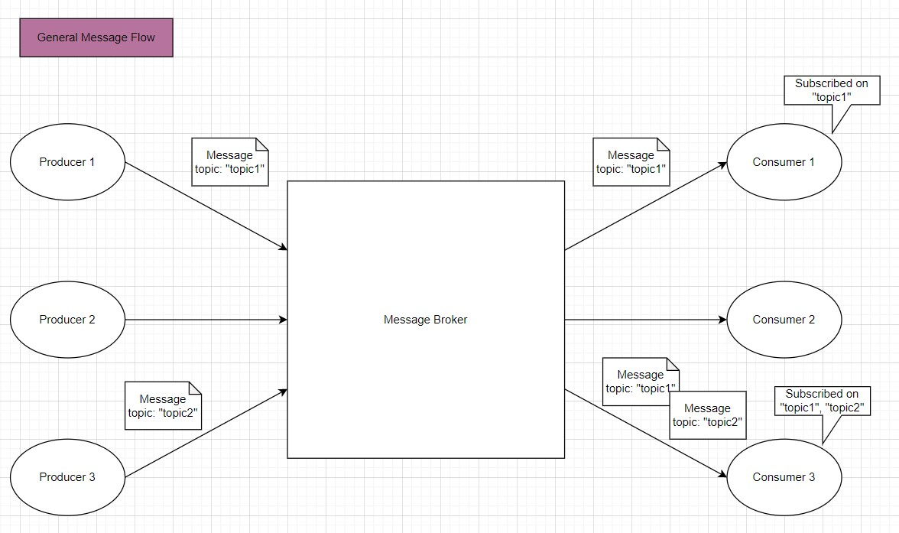
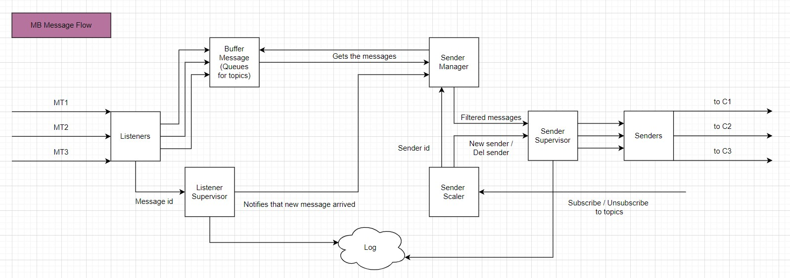
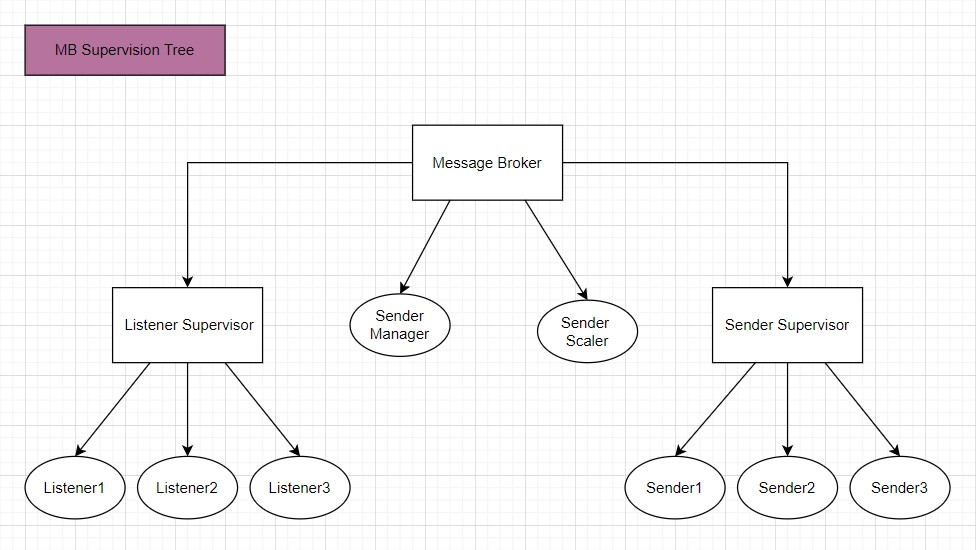

# PTR_Message_Broker
This project structure is presented in three diagrams. It is shown the path of the messages inside the message broker. Also the project is based on the actor model, so each actor has its own duties iside the message broker.

# General Message Flow

# Message Flow Inside The Message Broker

# Message Broker Supervision Tree

